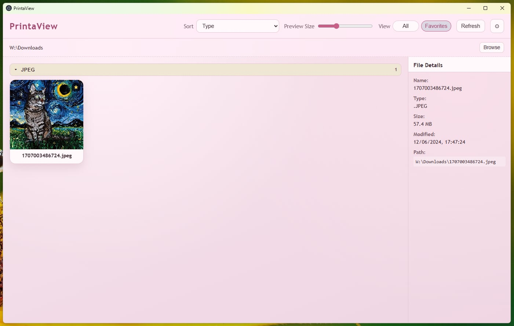
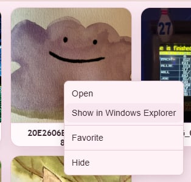
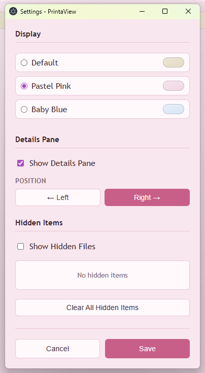

# PrintaView

PrintaView is a standalone Windows desktop app for browsing and previewing files from your Downloads folder in one unified view (including all subfolders).



*Main application view*



*Right-click context menu with hide and favorite actions*



*Settings window, including hidden files toggle*

## Features

- Recursive file browser for your configured root folder (defaults to `Downloads`, with `Browse` to switch).
- Shows supported files only: images (`png`, `jpg`, `jpeg`, `bmp`, `gif`, `webp`, `tif`, `tiff`, `ico`) and `pdf`.
- Image thumbnails and generated PDF first-page thumbnails (with page count).
- Generic type tiles for supported non-image/non-PDF files (for example `docx` and `pptx`).
- Right-click actions: `Open`, `Show in Windows Explorer`, `Favorite`/`Unfavorite`, and `Hide`/`Unhide`.
- Favorites workflow with toolbar filter toggle (`All` / `Favorites`).
- Hidden items are app-managed (do not change the Windows hidden attribute), with `Show Hidden Files`, per-item unhide, and `Clear All Hidden Items` in Settings.
- Sort options: `Most Recently Downloaded`, `Name`, and `Type` (with expandable type groups).
- Adjustable preview size slider.
- Optional details pane with file metadata and configurable left/right pane position.
- Theme selection (`Default`, `Pastel Pink`, `Baby Blue`) in Settings.

## Development

1. Install dependencies:

```powershell
npm install
```

2. Run the app:

```powershell
npm start
```

3. Run tests:

```powershell
npm test
```

## Build Standalone Portable EXE (Windows)

```powershell
npm run build:win
```

Build output is written to the `release` folder as a portable executable that can be run from anywhere.

## Version Bumping and GitHub Releases (CI/CD)

This repo includes a GitHub Actions workflow at [.github/workflows/release.yml](.github/workflows/release.yml) that:

- Triggers on tags like `v1.2.3`
- Validates the tag version matches `package.json` version
- Builds the Windows portable EXE
- Creates a GitHub release and uploads the EXE

Use this flow when releasing:

1. Bump version (updates `package.json` and `package-lock.json`):

```powershell
npm version patch --no-git-tag-version
```

Use `minor` or `major` instead of `patch` when needed.

2. Commit and push:

```powershell
git add package.json package-lock.json
git commit -m "chore: bump version to x.y.z"
git push
```

3. Create and push matching release tag (must match `package.json`):

```powershell
git tag vX.Y.Z
git push origin vX.Y.Z
```

After the tag is pushed, GitHub Actions will build and publish the release artifact automatically.
